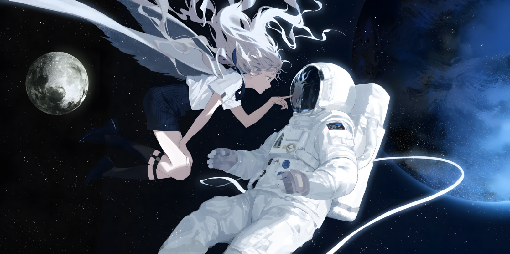

  

  🎨 Art by <a href="https://x.com/kazari_tayu" target="_blank">@kazari_tayu</a>

  
  
  

---

### 💫 About Me

**Hinno - Hinno Nguyen 🐧🎨💻🎮🎏**

❖ **Vietnamese** 🇻🇳  
❖ **Artist • Designer • Gamer • Coder**  
❖ **Information System - VNUHCM.UIT Undergraduate**  

💻 **AI Engineer, Game Design, and Software Development**

🐧 **Building intelligent systems, scalable backends, interactive frontends, and immersive game experiences.**
